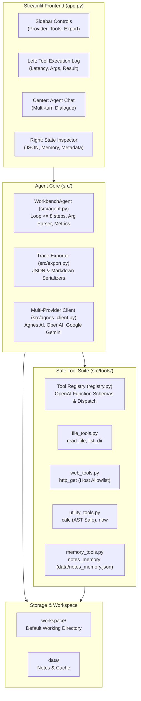

# System architecture

Agent Workbench runs an LLM agent on Windows 11 using Streamlit. It handles multi-turn conversations, runs local tools, and records execution steps and latencies.

## 1. System overview



## 2. Core components

### 2.1 User interface (app.py)
The Streamlit app organizes the interface into three columns:
- Left: Tool execution log displaying invocation order, latency in milliseconds, arguments, and truncated results.
- Center: Chat interface displaying user and assistant messages along with tool call summaries.
- Right: State inspector displaying session counts, notes memory from `data/notes_memory.json`, and environment metadata.

The sidebar handles provider and model selection, tool toggles, and trace downloads.

### 2.2 Agent loop (src/agent.py)
`WorkbenchAgent` coordinates conversation flow and tool execution:
- The turn loop calls the model and executes requested tools until the model stops calling tools or hits the step limit (default 8).
- The argument parser handles varied model outputs, including JSON strings, Python literals, and single string inputs.
- Step telemetry logs tool name, arguments, latency in seconds, and truncated results.

### 2.3 Provider client (src/agnes_client.py)
The client connects through the official `openai` Python SDK:
- Default provider: Agnes AI (`https://apihub.agnes-ai.com/v1`, model `agnes-3.0-flash`).
- Optional providers: OpenAI (`gpt-5.6-luna`, `gpt-5.6-terra`) when `OPENAI_API_KEY` is present; Google Gemini (`gemini-3.5-flash-lite`, `gemini-3.7-flash`) when `GOOGLE_API_KEY` is present.
- Provider detection checks whether variables exist in `os.environ` without reading or logging key values.

### 2.4 Tool suite (src/tools/)
Tools use `ToolDefinition` instances that generate OpenAI function schemas:
- `list_dir`: Lists directory contents with file sizes and directory flags.
- `read_file`: Reads text files with character limits to prevent token overflow.
- `http_get`: Sends HTTP GET requests to allowlisted domains.
- `calc`: Evaluates arithmetic expressions with Python's `ast` module.
- `now`: Returns ISO-8601 timestamps in UTC and local time.
- `write_note`: Writes or appends notes strictly inside `workspace/`.

## 3. Security model

| Vector | Risk | Mitigation |
|---|---|---|
| Arbitrary code execution | System command execution | No subprocess, os.system, eval(), or shell access. |
| Expression evaluation | Code injection through math evaluation | Expressions parsed into an abstract syntax tree. Only standard arithmetic and select math functions run; imports and dunder attributes fail. |
| Path traversal | Unauthorized filesystem access | Paths resolve strictly inside `workspace/`. Traversal attempts above `workspace/` raise permission errors. |
| SSRF and network access | Requests to internal network or metadata endpoints | Outbound requests require HTTPS and must match the host allowlist in `DEFAULT_ALLOWLIST`. |
| Credential exfiltration | Exposing API keys in logs or files | Keys stay in the environment. `.env.example` lists variable names only. Git ignores `.env` files. |


## 4. Trace and export format

Traces are serialized through `src/export.py`:

```json
{
  "timestamp_utc": "2026-09-19T16:55:00.000000+00:00",
  "metadata": {
    "provider": "Agnes AI",
    "model": "agnes-3.0-flash",
    "working_directory": "D:\\AI\\Github\\agent-workbench\\workspace",
    "total_messages": 4,
    "total_steps": 2,
    "total_latency_seconds": 6.018
  },
  "steps": [
    {
      "step_index": 1,
      "name": "list_dir",
      "args": { "path": "." },
      "result": "{...}",
      "latency": 0.0007,
      "tool_call_id": "call_123"
    }
  ],
  "messages": [...]
}
```
