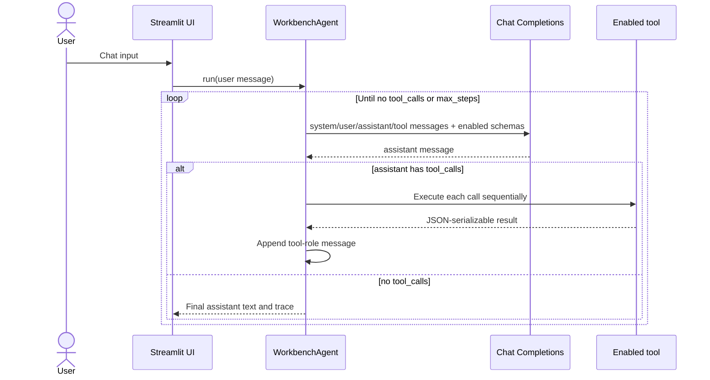

# Architecture

## Agent loop

`app.py` owns session UI state, provider and tool controls, the chat view, tool
timeline, live state, and trace downloads.

`src/agent.py` sends the conversation through
`client.chat.completions.create(...)`. When the assistant returns
`tool_calls`, the agent records the calls, dispatches enabled tools, appends
official `tool` messages, and calls Chat Completions again. Free assistant text
is never parsed to invent tool calls.

`src/tools/registry.py` exposes exactly six function schemas. File handlers use
the fixed repository `workspace/` root. Network policy lives in
`src/config.py`.

See the [supported API reference](API_REFERENCE.md) for construction
parameters, payload shapes, tool schemas, and extension boundaries.

## Message roles

| Role | Purpose |
| --- | --- |
| `system` | Defines tool-use and safety behavior |
| `user` | Contains one submitted chat message |
| `assistant` | Contains final text or official `tool_calls` |
| `tool` | Returns one result matched by `tool_call_id` |

The agent preserves these messages across Streamlit reruns. Malformed tool
arguments become an error-valued `tool` message, so the next model call can
recover without crashing the loop.

## Limits

- Default tool-step limit: 8
- Hard tool-step limit: 16
- Displayed tool result limit: 1,200 characters
- File read limit: 64 KiB
- HTTP response limit: 4,000 characters
- HTTP timeout: 10 seconds

`max_steps` counts executed tool calls. The sidebar default is 8 and the
agent enforces a hard cap of 16.

## Provider visibility

Agnes AI is always the default selection. OpenAI-compatible appears only when
both `OPENAI_API_KEY` and `OPENAI_BASE_URL` exist. Google Gemini appears only
when `GOOGLE_API_KEY` exists. Credential values never enter Streamlit state or
trace exports.
